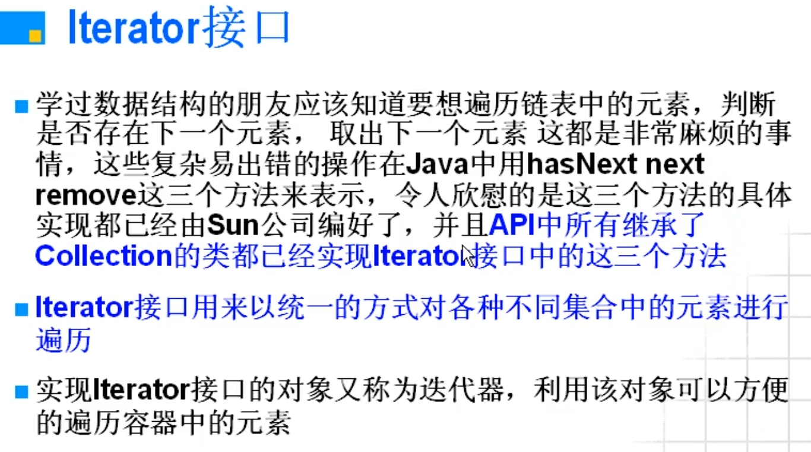
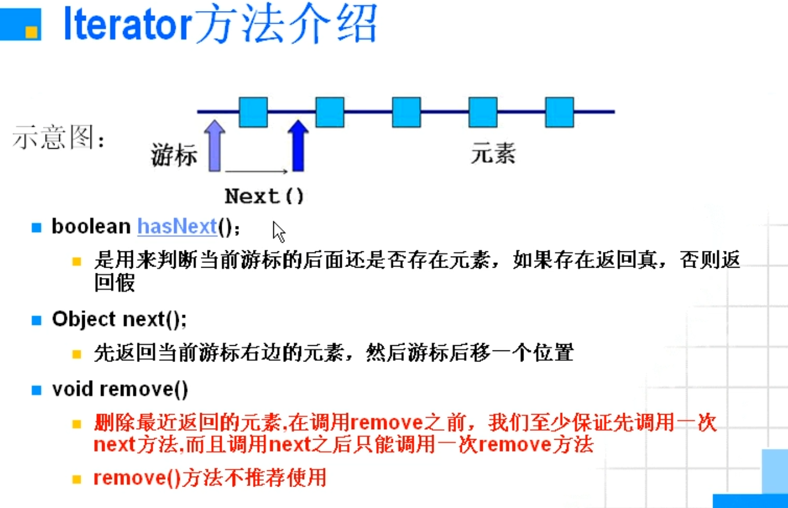

## Iterator接口



#### Iterator方法介绍




#### 遍历的实现方法

```java
vpackage a;

import java.util.Collection;
import java.util.Iterator;

public class TestIterator_1
{
    public static void showCollection(Collection c)
    {
        Iterator it = c.iterator();
        while (it.hasNext())
        {
            System.out.println(it.next());
        }
    }
}
```

