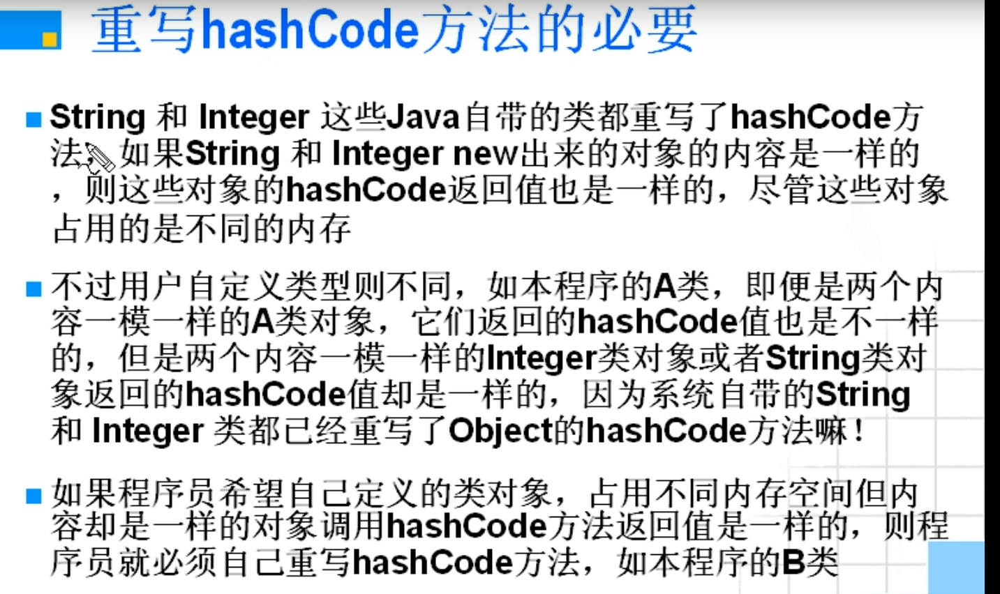

## hashCode()有关的内容

---

#### 不错的文章

[浅谈Java中的hashcode方法](https://www.cnblogs.com/dolphin0520/p/3681042.html)


---

#### 重写hashCode方法的必要



---

#### 个人组织语言

hashCode原本是因为如果**对象的地址不同**就会分配不一样的值来标记, 而大部分情况下我们只根据这个对象的内容是否一样来区分是不是一样的(使用容器的时候), 所以我们需要重写hashCode

---

#### HashSet容器add()的底层逻辑

这里面需要用到 `hashCode()`方法以及`equal()`方法

底层逻辑就是哈希表算法的拉链法

当add一个元素的时候, 会用哈希函数得到一个值, 在Java中通常返回地址(没被重写前), 显然与我们需要的内容相同的需求不一致, 所以需要重写成内容一样就返回一个相同的hash值, 我们假设 值为1和值为2的hash值经过该哈希函数产生了冲突, 也就是地址一样, 此时就需要去遍历该地址上面的一个线性表(多是用链表弄的), 来遍历该线性表看看有没有重复, 没有重复那就加入, 有那就不用加入

---

#### TreeSet为什么不用重写hashCode()?

HashSet是由一个**hash表**来实现的，因此，它的元素是**无序**的。add()，remove()，contains()方法的时间复杂度是O(1)。 
 TreeSet是由一个**红黑树**的结构来实现的，它里面的元素是**有序**的。因此，add()，remove()，contains()方法的时间复杂度是O(logn)。

---

#### 重写hashCode方法需要注意的地方

《Java 编程思想》中有一段话，对 `hashCode()` 方法进行了一段描述。

>  设计 `hashCode()` 时最重要的因素就是：无论何时，对同一个对象调用 `hashCode()` 都应该生成同样的值。如果在将一个对象用 `put()` 方法添加进 HashMap 时产生一个 `hashCode()` 值，而用 `get()` 方法取出时却产生了另外一个  `hashCode()` 值，那么就无法重新取得该对象了。所以，如果你的 `hashCode()` 方法依赖于对象中易变的数据，用户就要当心了，因为此数据发生变化时，`hashCode()` 就会生成一个不同的哈希值，相当于产生了一个不同的键。
>  

也就是说，如果在重写 `hashCode()` 和 `equals()` 方法时，对象中某个字段容易发生改变，那么最好舍弃这些字段，以免产生不可预期的结果。

---

#### C++源码:

```java
static inline intptr_t get_next_hash(Thread* current, oop obj) {
  intptr_t value = 0;
  if (hashCode == 0) {
    // This form uses global Park-Miller RNG.
    // On MP system we'll have lots of RW access to a global, so the
    // mechanism induces lots of coherency traffic.
    value = os::random();
  } else if (hashCode == 1) {
    // This variation has the property of being stable (idempotent)
    // between STW operations.  This can be useful in some of the 1-0
    // synchronization schemes.
    intptr_t addr_bits = cast_from_oop<intptr_t>(obj) >> 3;
    value = addr_bits ^ (addr_bits >> 5) ^ GVars.stw_random;
  } else if (hashCode == 2) {
    value = 1;            // for sensitivity testing
  } else if (hashCode == 3) {
    value = ++GVars.hc_sequence;
  } else if (hashCode == 4) {
    value = cast_from_oop<intptr_t>(obj);
  } else {
    // Marsaglia's xor-shift scheme with thread-specific state
    // This is probably the best overall implementation -- we'll
    // likely make this the default in future releases.
    unsigned t = current->_hashStateX;
    t ^= (t << 11);
    current->_hashStateX = current->_hashStateY;
    current->_hashStateY = current->_hashStateZ;
    current->_hashStateZ = current->_hashStateW;
    unsigned v = current->_hashStateW;
    v = (v ^ (v >> 19)) ^ (t ^ (t >> 8));
    current->_hashStateW = v;
    value = v;
  }

  value &= markWord::hash_mask;
  if (value == 0) value = 0xBAD;
  assert(value != markWord::no_hash, "invariant");
  return value;
}
```

其中的 `hashCode` 变量是 JVM 启动时的一个全局参数，可以通过它来切换哈希值的生成策略。

- `hashCode==0`，调用操作系统 OS 的 `random()` 方法返回随机数。
- `hashCode == 1`，在 STW（stop-the-world）操作中，这种策略通常用于同步方案中。利用对象地址进行计算，使用不经常更新的随机数（`GVars.stw_random`）参与其中。
- `hashCode == 2`，使用返回 1，用于某些情况下的测试。
- `hashCode == 3`，从 0 开始计算哈希值，不是线程安全的，多个线程可能会得到相同的哈希值。
- `hashCode == 4`，与创建对象的内存位置有关，原样输出。
- `hashCode == 5`，默认值，支持多线程，使用了 Marsaglia 的 xor-shift 算法产生伪随机数。所谓的 xor-shift 算法，简单来说，看起来就是一个移位寄存器，每次移入的位由寄存器中若干位取异或生成。所谓的伪随机数，不是完全随机的，但是真随机生成比较困难，所以只要能通过一定的随机数统计检测，就可以当作真随机数来使用。