## 容器

也叫做集合


---

- 开篇实例1

```java
package a;

import java.util.ArrayList;

class A
{
    public String toString()
    {
        return "时崎狂三";
    }
}

public class Test
{
    public static void main(String[] args)
    {
        ArrayList al = new ArrayList();
        al.add(12345);// 虽然12345都是
        al.add("五河琴里");
        al.add(66.66); 
        al.add(new A());
        System.out.println(al);
    }
}
```


```java
int i = 12345;// 就是个值, 不是对象
Integer it = new Integer(i);
int j = i + it;
it.toString();

这里会涉及到一个自动装箱和拆箱的知识
```

- 自动装箱和拆箱: [[深入剖析Java中的装箱和拆箱](https://www.cnblogs.com/dolphin0520/p/3780005.html)

---

## 大纲

- 为什么需要容器
- 容器的分类和使用
  - Collection
    - Set
    - List
  - Map
- Collections类
- Comparale接口
- Iterator接口

---

#### 为什么需要容器

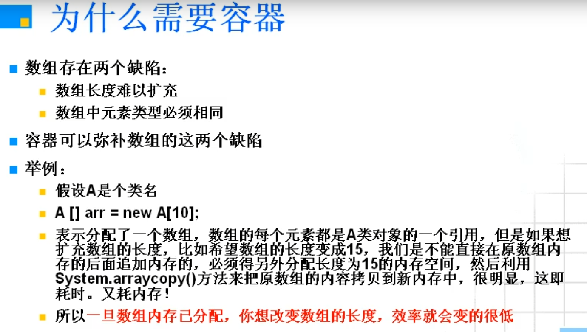

---

##### 容器与现实的对应关系

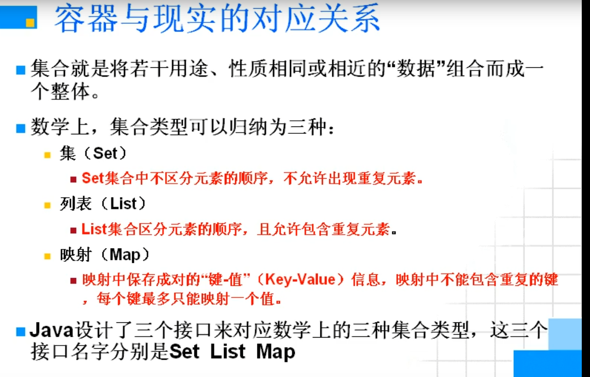


##### 容器的API

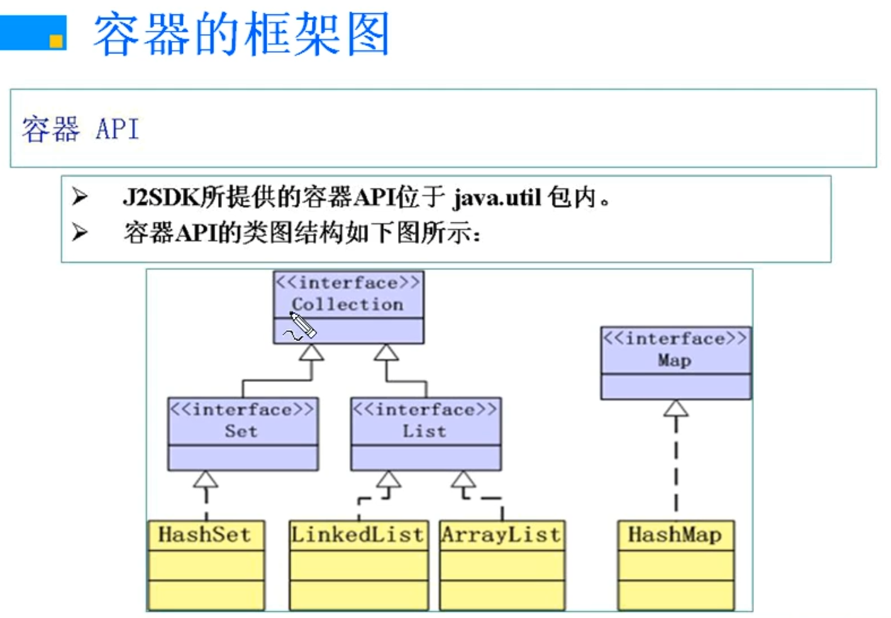

- 可以看出来和流的框架是不一样的, 流的框架是以抽象类为核心的, 而容器是以接口为核心的

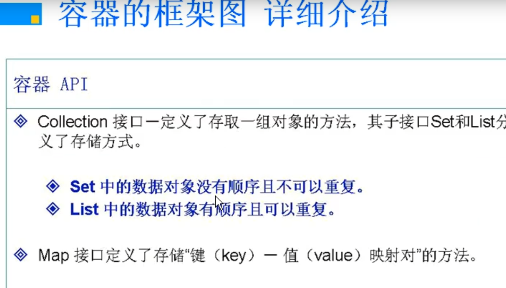


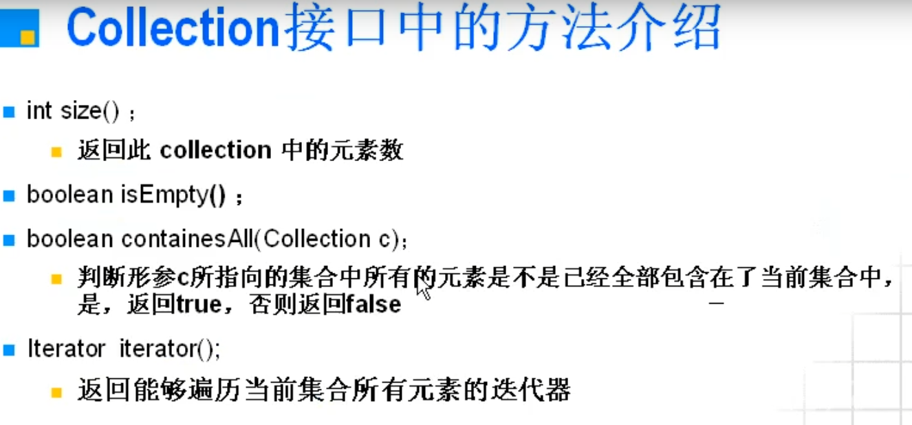

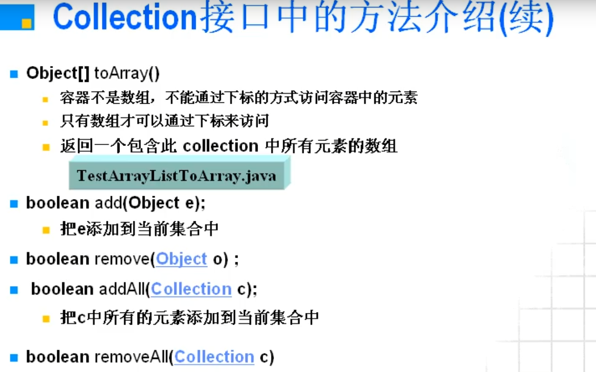

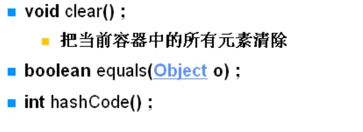

##### Collection接口的子接口-List接口

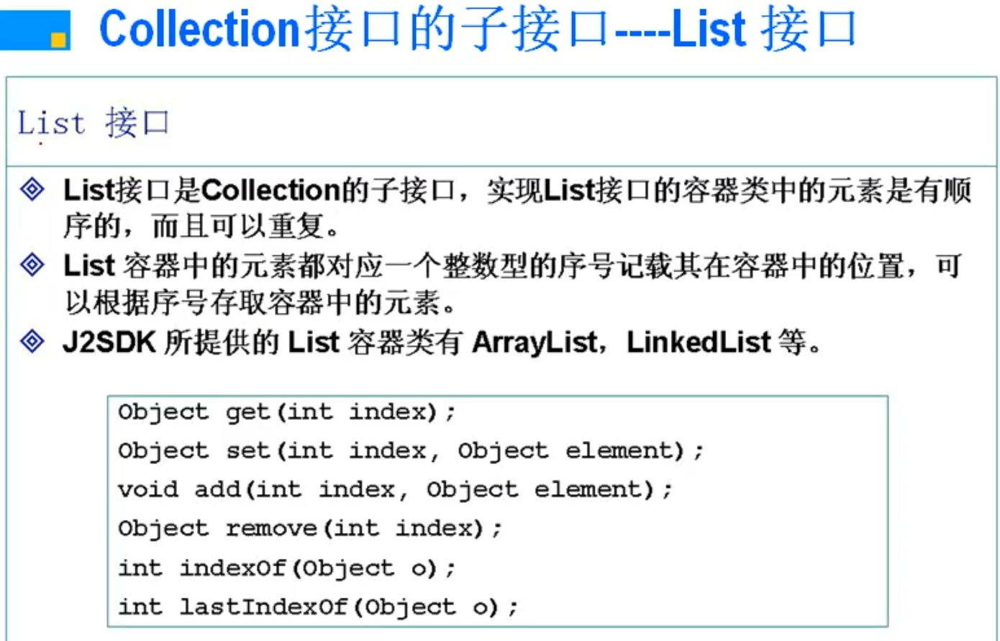


##### Collection接口的子接口-Set接口

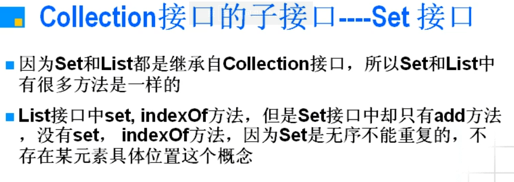

##### 预备知识-toString方法

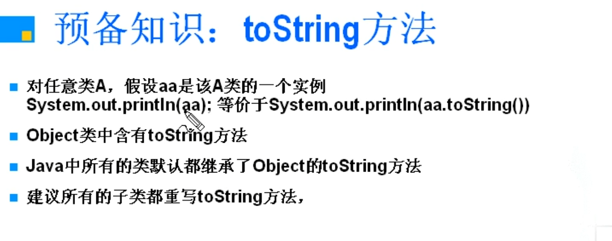


- <strong style="color:red;">强烈建议所有添加到Collection容器中的对象都应该重写父类Object的toString方法</strong>

##### Collection接口实现类示例总结

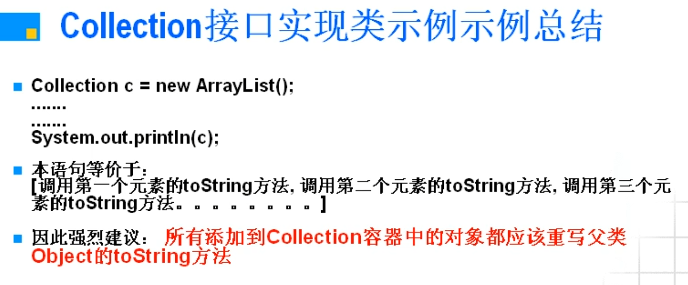


##### ArrayList与LinkedList的比较


---

#### Collections类


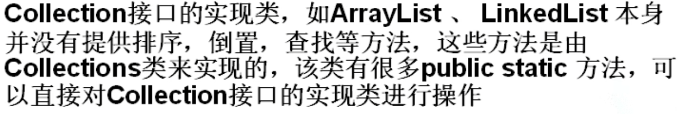


##### Collections类常用算法

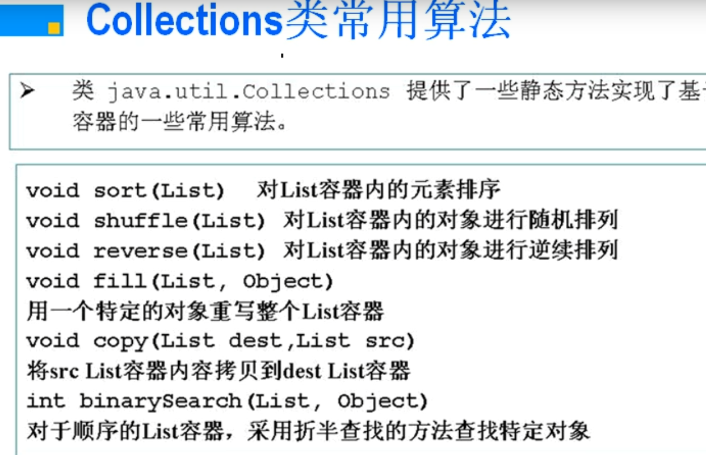


---

#### Comparale接口


- **排序实例**

  ```java
  package a;
  
  import java.util.ArrayList;
  import java.util.Collections;
  
  class Student implements Comparable// 先要实现接口, 然后重写compareTo方法
  {
      private int id;
      private String name;
  
      public Student(int id, String name)
      {
          this.id = id;
          this.name = name;
      }
  
      @Override
      public String toString()
      {
          return id + " " + name;
      }
  
      @Override
      public int compareTo(Object o)// 重写compareTo方法
      {
          Student st = (Student) o;// 多态情况下, 通过父类引用不能访问子类对象所特有的成员, 具体见多态下的多态注意事项
          if(this.id == st.id)
              return 0;
          else if(this.id > st.id)
              return 1;
          else
              return -1;
      }
  }
  
  public class TestList
  {
      public static void main(String[] args)
      {
          ArrayList L = new ArrayList();
          L.add(new Student(1000, "时崎狂三"));
          L.add(new Student(1002, "鸢一折纸"));
          L.add(new Student(1001, "五河琴里"));
  
          Collections.sort(L);
  
          System.out.println(L);
      }
  }
  ```

##### 为何要使用Comparable接口

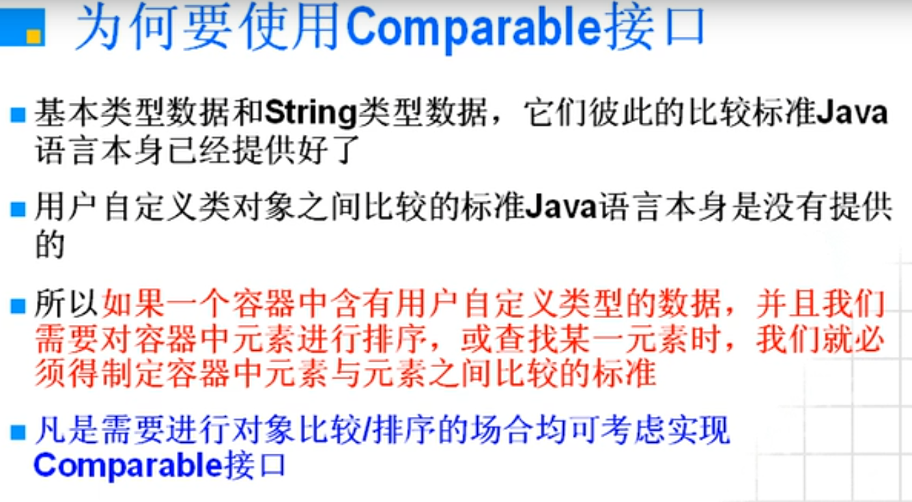


##### Comparabel接口介绍

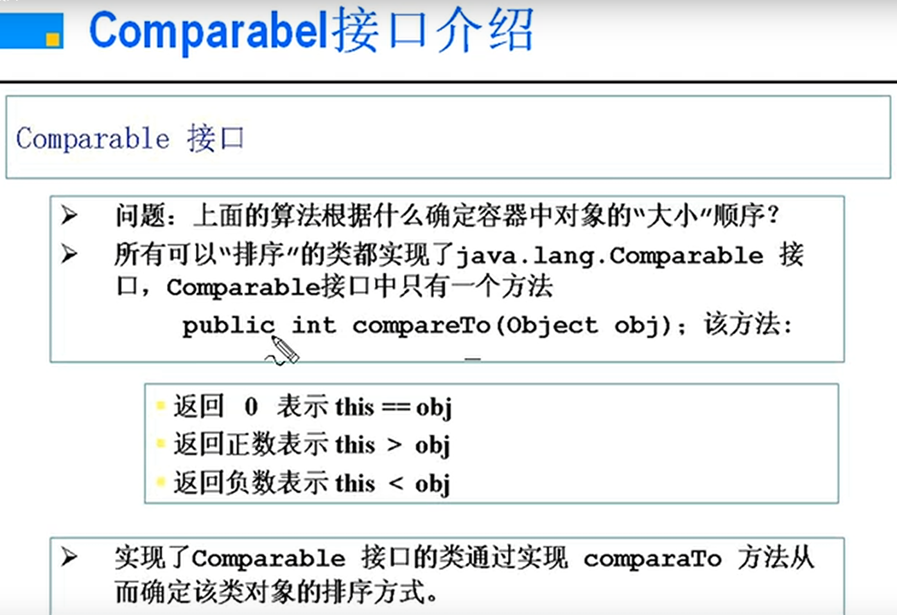


---

#### Set接口介绍

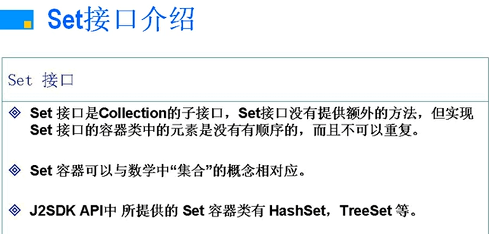


- **注意要使用Set, 需要重写`public int hashCode()` 和 `public boolean equals(Object ob)`, 否则无法实现去重的操作**

- 程序示例

```java
package a;

import java.util.ArrayList;
import java.util.Collections;
import java.util.HashSet;
import java.util.Set;

class Student
{
    private int id;
    private String name;

    public Student(int id, String name)
    {
        this.id = id;
        this.name = name;
    }

    @Override
    public String toString()
    {
        return id + " " + name;
    }

    @Override
    public boolean equals(Object ob)
    {
        Student st = (Student) ob;
        return st.id == this.id && st.name == this.name;
    }

    @Override
    public int hashCode()
    {
        return id * this.name.hashCode();// 其实不是乘也是可以的, 这样的式子要相等, 首先id和另个元素的其中参数要一样,name的参数要和另一个一样
    }
}

public class TestSet
{
    public static void main(String[] args)
    {
        Set S = new HashSet();// 注意不能写Set, 因为Set是接口(抽象类), 不能new出对象
        S.add(new Student(1000, "时崎狂三"));
        S.add(new Student(1000, "时崎狂三"));
        S.add(new Student(1000, "时崎狂三"));
        S.add(new Student(1000, "时崎狂三"));
        S.add(new Student(1002, "鸢一折纸"));
        S.add(new Student(1001, "五河琴里"));

        System.out.println(S);
    }
}
```


---

#### Map

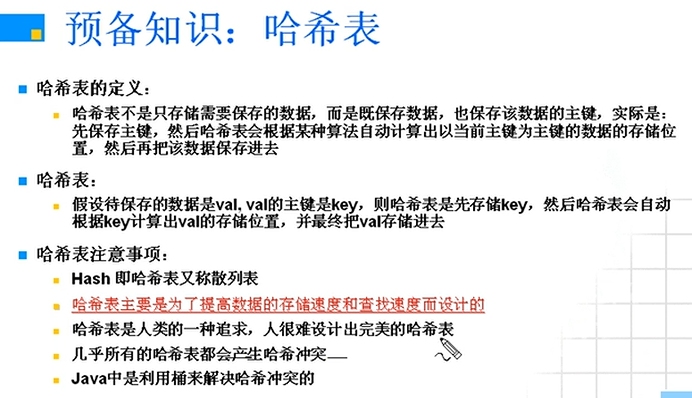

- 因为哈希表的不完美性, "现实骨感...", 数组和链表得以保存

