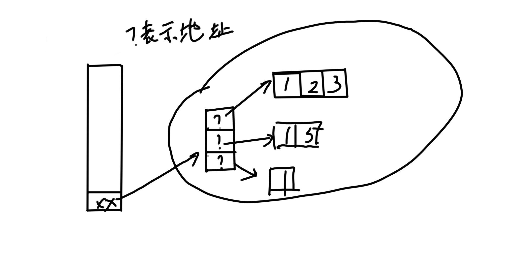

## Java数组

- java数组本质和C是一样的
- 所以不用详细写


---


- 常见的操作

```java
public static void main(String[] args)
    {
        int[] arr2 = new int[10];
        showArr(arr2);
    }
```

- 其中 arr2 在stack区
- int[10]产生的十块连续空间在heap区, 初始值为0


- 引用数组

```java
public static void main(String[] args)
    {
        MyData[] m;
    	m = new MyData[10];
    }
```

- 其中的 MyData[] 说明这是个引用, m 在 stack 区
- MyData是个类
- `new MyData[10]` 产生的10块连续空间在 heap 区, 初始值为 null, 即将用于二次指向
- <strong style="color:red;">引用类型元素组成的一维数组在使用过程中一般存在着两级的指向关系, 这是理解多维不登长数组的基础</strong>

---

##### 多维数组

```java
public class M
{
    public static void main(String[] args)
    {
        int[][] xx = new int[2][3];
        int[][] xx = {{1,2,3}, {1, 5}, {1}};
    }
}
```

- 其中`int[][] xx = {{1,2,3}, {1, 5}, {1}};`表示xx在stack空间, 然后先是有3块连续的空间, 然后第一块指向一块3块连续的空间, 第二块指向2块连续的空间, 第三块指向1块连续的空间

  

- `int[][] xx = new int[2][3];` 指的是xx在stack空间, 先有2块连续的空间, 然后每个空间分别指向3块连续的空间


---

##### 数组拷贝

```java
package aa;

public class M
{
    public static void main(String[] args)
    {
        int[] a = {1, 2, 3, 4, 5};
        int[] b = {-1, -2, -3, -4, -5};

        System.arraycopy(a, 0, b, 1, 2);

        System.out.println("a = ");
        for(int i = 0; i < a.length; i ++)
        {
            System.out.println(a[i]);
        }

        System.out.println("b = ");
        for(int i = 0; i < a.length; i ++)
        {
            System.out.println(b[i]);
        }
    }
}
------------------------------------------------------------------------------
结果:
a = 
1
2
3
4
5
b = 
-1
1
2
-4
-5
```

---

##### 数组的排序

`Arrays.sort();`


```java
package aa;

import java.lang.reflect.Array;
import java.util.Arrays;

public class M
{
    public static void main(String[] args)
    {
        int[] a = {2, 1, 10, -1, 1};

        Arrays.sort(a);

        for(int i : a)
        {
            System.out.println(i);
        }
    }
}
```

