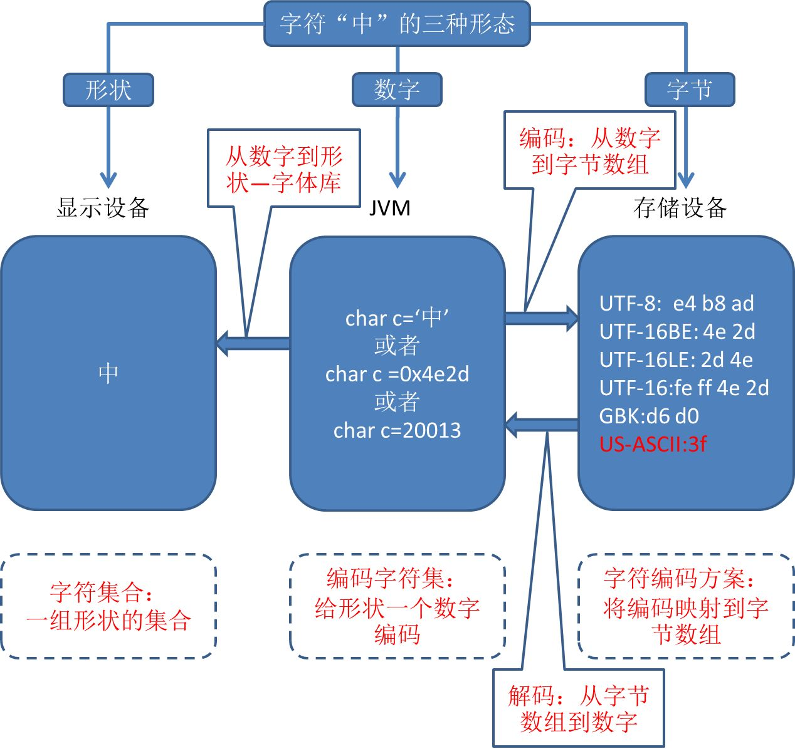

# Java字符的编码解码与乱码问题

## 1. 前言

编码、解码、乱码、Unicode、UCS-2、UCS-4、UTF-8、UTF-16、Big Endian、Little Endian、GBK这些名词，如果你有一个不太清楚，那么建议看看本文。

## 2. 一幅图说尽Java编码问题

#### 2.1 一幅图与四个概念





字符有三种形态：形状（显示在显示设备上）、数字（运行于JVM中，Java统一为unicode编码）和字节数组（不同的字符集有不同的映射方案）。
如此就可以明白四个重要的实体概念了（这四个概念来自于《Java NIO》一书）：
**字符集合（Character set）**：是一组形状的集合，例如所有汉字的集合，发明于公元前，发明者是仓颉。它体现了字符的“形状”，它与计算机、编码等无关。
**编码字符集（Coded character set）**：是一组字符对应的编码（即数字），为字符集合中的每一个字符给予一个数字。例如最早的编码字符集ASCII，发明于1967年。再例如Java使用的unicode，发明于1994年（持续更新中）。由于编码字符集为每一个字符赋予一个数字，因此在java内部，字符可以认为就是一个16位的数字，因此以下方式都可以给字符赋值：


```text
char c=‘中’
char c =0x4e2d
char c=20013
```

**字符编码方案（Character-encoding schema）**：将字符编码（数字）映射到一个字节数组的方案，因为在磁盘里，所有信息都是以字节的方式存储的。因此Java的16位字符必须转换为一个字节数组才能够存储。例如UTF-8字符编码方案，它可以将一个字符转换为1、2、3或者4个字节。
一般认为，编码字符集和字符编码方案合起来被称之为**字符集（Charset）**，这是一个术语，要和前面的字符集合（Character set）区分开。

#### 2.2 转换的类型

##### 2.2.1. 从数字到形状—字体库

从JVM中的字符编码，到屏幕上显示的形状。这个转换是在字体库的帮助下完成的。例如windows默认的一些汉字字体，在Java中运行时是一个个的数字编码，例如0x4e2d，通过查找字体库，得到一个形状“中”，然后显示在屏幕上。

##### 2.2.2. 从数字到字节数组—编码

从JVM中的编码，到字节数组，这个转换被称之为编码。转换的目的是为了存储，或者发送信息。
同一个数字，例如0x4e2d，采用不同的字符集进行编码，能得到不同的字节数组。如图中所见。
至于具体的UTF-8、GBK、UTF-16等字符集的历史渊源，具体转换方式都有很多的资料可以查询。
编码的例子代码如下：
第一种方法，使用String的getBytes方法：

```text
private static byte[] encoding1(String str, String charset) throws UnsupportedEncodingException {
    return str.getBytes(charset);
}
```

第二种方法，使用Charset的encode方法：

```text
    private static byte[] encoding2(String str, String charset) {
        Charset cset = Charset.forName(charset);
        ByteBuffer byteBuffer = cset.encode(str);
        byte[] bytes = new byte[byteBuffer.remaining()];
        byteBuffer.get(bytes);
        return bytes;
}
```

注意：Charset、ByteBuffer以及后文中提到的CharBuffer类都是Java NIO包中的类，具体使用方法可参考《Java NIO》一书。

##### 2.2.3. 从字节数组到数字—解码

从一个字节数组，到一个代表字符的数字，这个转换被称之为解码。解码一般是将从磁盘或者网络上得到的信息，转换为字符或字符串。
注意解码时一定要指定字符集，否则将会使用默认的字符集进行解码。如果使用了错误的字符集，则会出现乱码。
解码的例子代码如下：
第一种方法，使用String的构造函数：

```text
private static String decoding1(byte[] bytes,String charset) throws UnsupportedEncodingException 
	{
        String str = new String(bytes, charset);
        return str;
    }
```

第二种方法，使用Charset的decode方法：

```text
private static String decoding2(byte[] bytes, String charset) 
    {
        Charset cset = Charset.forName(charset);
        ByteBuffer buffer = ByteBuffer.wrap(bytes);
        CharBuffer charBuffer = cset.decode(buffer);
        return charBuffer.toString();
    }
```

##### 2.3 默认的字符集

乱码问题都是因为在编码或者解码时使用了错误的字符集导致的。如果不能明白什么是默认的字符集，则很有可能导致乱码。
Java的默认字符集，可以在两个地方设定，一是执行java程序时使用-Dfile.encoding参数指定，例如-Dfile.encoding=UTF-8就指定默认字符集是UTF-8。二是在程序执行时使用Properties进行指定，如下：

```text
private static void setEncoding(String charset) 
{
    Properties properties = System.getProperties();
    properties.put("file.encoding",charset);
    System.out.println(properties.get("file.encoding"));
}
```

注意，这两种方法如果同时使用，则程序开始时使用参数指定的字符集，在Properties方法后使用Properties指定的字符集。
如果这两种方法都没有使用，则使用操作系统默认的字符集。例如中文版windows 7的默认字符集是GBK。
默认字符集的优先级如下：
1.程序执行时使用Properties指定的字符集；
2.java命令的-Dfile.encoding参数指定的字符集；
3.操作系统默认的字符集；
4.JDK中默认的字符集，我跟踪了JDK1.8的源代码，发现其默认字符集指定为ISO-8859-1。

##### 2.3.1. JDK支持的字符集

Charset类提供了一个方法可以列出当前JDK所支持的所有字符集，代码如下：

```text
private static void printAvailableCharsets() 
{
    Map<String ,Charset> map = Charset.availableCharsets();
    System.out.println("the available Charsets supported by jdk:"+map.size());
    for (Map.Entry<String, Charset> entry :
            map.entrySet()) {
        System.out.println(entry.getKey());
    }
}
```

本测试机使用的JDK为1.8，列出的字符集多达169个。

#### 3. 乱码

##### 3.1 如何产生乱码

从上述章节可知，字符的形态有三种，分别是“形状”、“数字”和“字节”。字符的三种形态之间的转换也有三类：从数字到形状，从数字到字节（编码），从字节到数字（解码）。
从数字到形状不会产生乱码，乱码就产生在编码和解码的时候。仔细想来，编码也是不会产生乱码的，因为从数字到字节（指定某个字符集）一定能够转换成功，即使某字符集中不包含该数字，它也会用指定的字节来代替，并在转换时给出指示。
如此一来，乱码只会产生在解码时：例如使用某字符集A编码的字节，使用字符集B来进行解码，而A和B并不兼容。这样一来，解码产生的数字（字符编码）就是错误的，那么它显示出来也是错误的，典型的乱码例子如下（使用UTF-8编码，使用GBK解码）：

```text
private static void generateGrabledCode() throws UnsupportedEncodingException {
    String str = "中国";
    byte[] bytes = str.getBytes("UTF-8");
    str = new String(bytes, "GBK");
    System.out.println(str);
}
```

#### 4. 再论Unicode、UTF和GBK

弄清楚了以上的概念和例子，再来看unicode、UCS-2、UCS-4、UTF-8、UTF-16、Big Endian、Little Endian、GBK这些名词就有了辨别的好方法了。
再复习一遍概念：
字符集合（Character set）：是一组形状的集合，一般存储于字库中。
编码字符集（Coded character set）：是一组字符对应的编码（即数字），为字符集合中的每一个字符给予一个数字。
字符编码方案（Character-encoding schema）：将字符编码（数字）映射到一个字节数组的方案。
字符集（Charset）：是编码字符集和字符编码方案的组合。

##### 4.1 Unicode是一个编码字符集

Unicode的全称是“Universal Multiple-Octet Coded Character Set”，通用多字节编码字符集，简写为UCS。
因此我们知道：Unicode规定了一组字符对应的编码。恰好这组字符就是全人类目前所有的字符。
那么UCS-2和UCS-4是什么意思？UCS-2是指用两个字节对应一个字符的编码字符集；UCS-4则是指用四个字节对应一个字符的编码字符集。你可以认为，目前为止Unicode有两个具体的编码字符集，UCS-2和UCS-4。
Java使用的是UCS-2，即我们前面提到的，一个字符由一个16位的二进制数（2个字节）表示。

##### 4.2 UTF是字符编码方案

看过很多文章，往往混淆Unicode和UTF，说不清它们之间的区别，用本文的概念很容易就解释清楚了。
Unicode是某种编码字符集（目前包括UCS-2和UCS-4两种），而UTF则是字符编码方案，就是将字符编码（数字）映射到一个字节数组的方案。UTF中的U是指Unicode，也就是将Unicode编码映射到字节数组的方案。目前UTF包括UTF-7、UTF-8、UTF-16和UTF-32，后面的数字代表转换时最小的位数。例如UTF-8就是用几个8位二进制数来代表一个Unicode编码。而UTF-15就是用几个16位二进制数来代表一个Unicode编码。

##### 4.3 Big Endian和Little Endian是字节序

字节序就是数据在内存中存放的顺序，多于一个字节的数据在内存中存放时有两种选择，即Big Endian和Little Endian。
Little-Endian就是低位字节排放在内存的低地址端，高位字节排放在内存的高地址端。
Big-Endian就是高位字节排放在内存的低地址端，低位字节排放在内存的高地址端。
Big Endian和Little Endian和芯片类型以及操作系统都有关系。但是由于Java是平台无关的，所以Java被设计为Big Endian的。但是当Java中的字符进行编码时，就要注意其字节序了。
例如UTF-16字符编码方案就分为UTF-16BE和UTF-16LE。

##### 4.4 GBK是一个字符集

GBK同时包含编码字符集和字符编码方案。GBK编码了目前使用的大多数汉字（编码字符集），它将每一个汉字映射为两个字节，对于英文和数字，它则使用与ASCII相同的一个字节编码（字符编码方案）。

#### 5. 小结

编码、解码和乱码问题，永远是程序员的梦魇。看懂一幅图，弄明白四个概念，也许有助于一劳永逸的解决此问题。


---


[Alex Wang](https://www.zhihu.com/people/wang-du-du-43-1)

高级工程师，Coder，Teamleader

作者：https://www.zhihu.com/people/wang-du-du-43-1

原答案：https://zhuanlan.zhihu.com/p/25435644