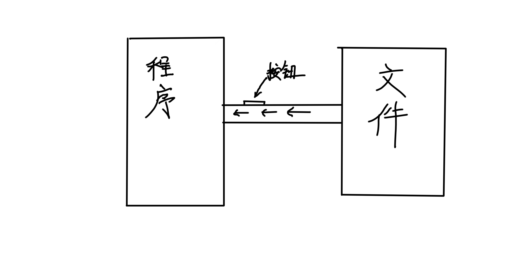
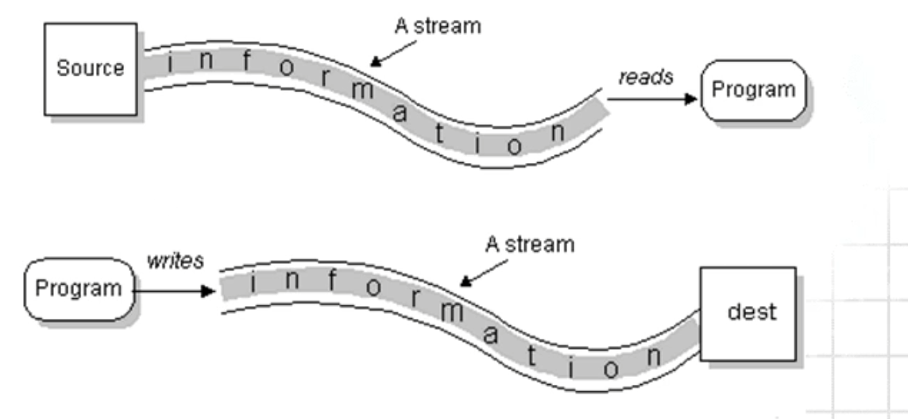
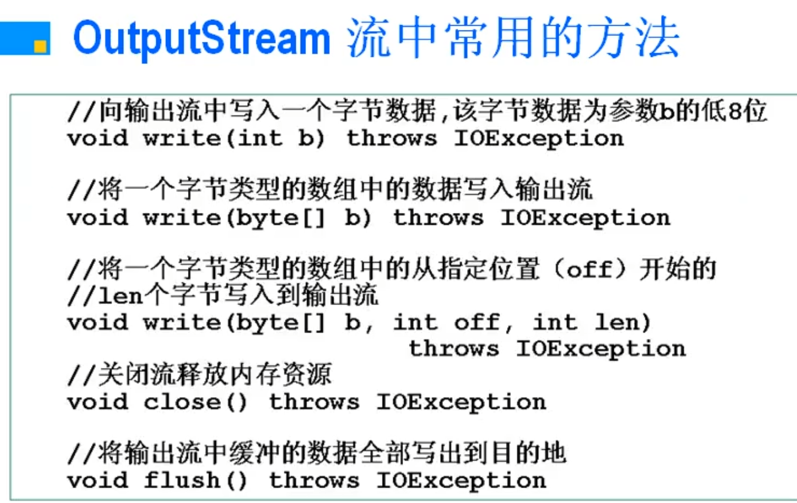
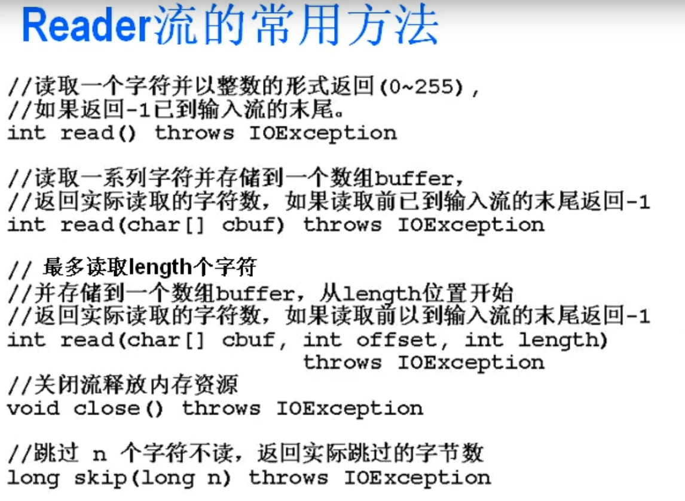
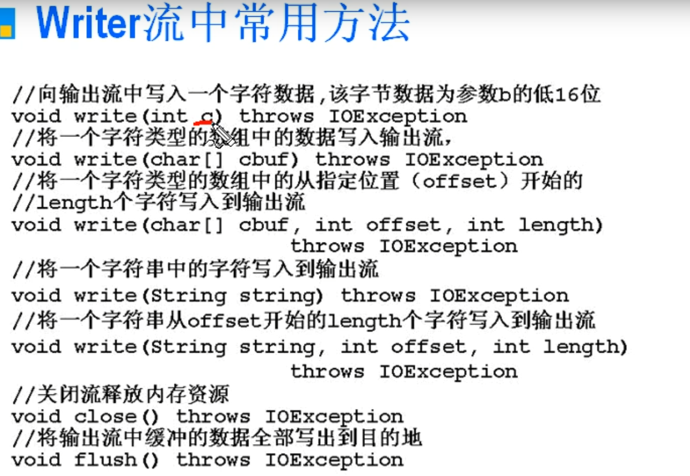
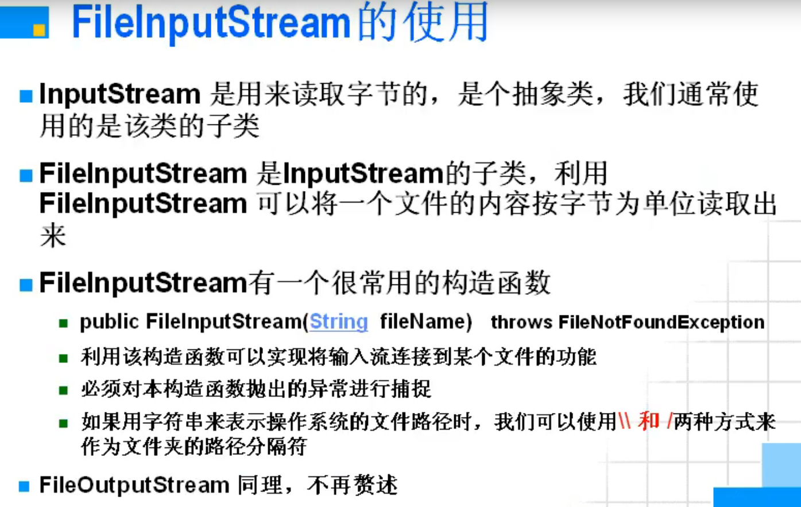
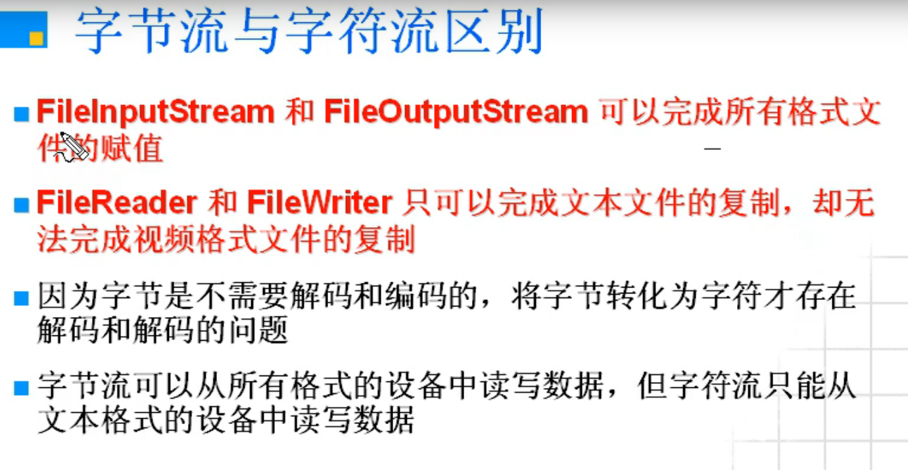

## 流

 "带有按钮的管道"




- 程序1

  ```java
  package a;
  
  import java.io.File;
  import java.io.FileNotFoundException;
  import java.io.FileReader;
  
  public class TestFileReader
  {
      public static void main(String[] args) throws Exception
      {
          FileReader fr = new FileReader("D:\\Java_Project\\流\\src\\a\\TestFileReader.java");;
  
          int ch;
          ch = fr.read();// read()返回的是int方法
  
          while(ch != -1)
          {
              System.out.printf("%c", ch);
              ch = fr.read();
          }
          fr.close();
      }
  }
  ```

---

#### 流大纲

- 流的定义
- 流的分类和使用
  - 四大基本抽象流
  - 文件流
  - 缓冲流
  - 转换流
  - 数据流
  - Print流
  - Object流

---

#### 流的定义

- <strong style="color:red;">流就是程序和设备之间嫁接起来的一根用于数据传输的管道</strong>, 这个管道上有很多按钮, 不同的按钮可以实现不同的功能
- 这根带按钮的用于数据传输的管道就是流
- 流就是一根管道



---

#### 流的分裂标准

- java,io 包中定义了多个流类型（类或抽象类）来实现输入/输出功能；可以从不同的角度对其进行分类
  - 按数据流的**方向不同**可以分为输入流和输出流。
  - 按处理**数据单位不同**可以分为字节流和字符流。
  - 按照功能不同可以分为节点流(原始流)和处理流(包裹流)。

- J2SDK 所提供的所有流类型位于包 `java.io` 内都分别继承自以下四种抽象流类型

  

|        |    字节流    | 字符流 |
| -----: | :----------: | ------ |
| 输入流 | InputStream  | Reader |
| 输出流 | OutputStream | Writer |

---

#### 节点流和处理流

- 节点流为可以从一个特定的数据源（节点）读写数据（如：文件，内存）

- 处理流是“连接”在已存在的流（节点流或处理流）之上，通过对数据的处理程序提供更为强大的读写功能。

- 节点流可以叫原始流, 处理流可以叫包裹流

---

#### 必须掌握的知识点

- 什么叫流
- 流与类的关系
  - 如果一个类是用作设备和程序之间的数据传输，则这个类有一个新的名字叫流
  - 流一定是类，但类不一定是流
- 原始流与包裹流关系

---

#### 四大基本抽象流

- Inputstream 和 OutputStream 读写数据的单位是**一个字节**
- Reader和 Writer读写数据的单位是**一个字符**
- **在Java中一个字符占两个字节**
- InputStream、 OutputStream、 Reader、 Writer 都是抽象类，或者说都是抽象流，通常我们使用的都是它们的子类
- 凡是以 Stream 结尾的都是字节流


---

### 文件流

---


##### InputStream流中常用的方法

- ```
  public int read（）throws IOException
  ```

  - 读取一个字节并以整数形式返回

  - 如果读取到输入流的未尾则返回 `-1`

    

- ```
  public int read(byte[] b);  throws IOException
  ```

  - 从输入流中读取一定数量的字节，并将其存储在缓冲区数组 b 中。以整数形式返回实际读取的字节数
  - 如果b的长度为0,则不读取任何字节并返回0;如果因为流位于文件末尾而没有可用的字节，则返回值-1
  - 例子:
    - FileInputStream fis = new FilelnputStream("d:\\\share\\\errorlog.txt");
    - len= fis. read(buf) // 从 fis 流所关联的 d: \\\share\\errorlog.txt 文件中读取数据，并将读取出来的数据写入buf数组中，返回值是实际写入buf数组的字节个数，如果读取到文件的结尾，则返回-1
    - **注意是: 写入到buf数组, read方法返回读入的字节数**


- ```java
  public int read( byte[] b, int off, int len) throws IOException
  ```

  - 从输入流中**最多**读取 len 个字节的数据并存入 `byte数组` 中
  - b 表示读取的数据要存入的数组的名字
  - off 表示第一个读出的数据要存入的位置，是下标
  - len表示最多能读取的字节数
  - <strong style="color:red;">将从输入流所关联到的设备中读取的第一个字节存储在元素`b[off]`们中，下个字节存储在 `[boff + 1]` 中，依次类推。读取的字节数最多等于 `len `</strong>
  - 尝试读取 `len` 个字节，但读取的字节也可能小于该值。以整数形式返回实际读取的字节数
  - 如果读到了文件的末尾，则返回 `-1`


- ```java
  void close() throws IOException
  ```

  - 关闭此输入流并释放与该流关联的所有系统资源


- ```java
   long skip(long n) throws IOException
  ```

  - 跳过和丢弃此输入流中数据的 `n` 个字节, 这个用的很少


OutputStream 流中常用的方法




##### Reader流的常用方法



##### Writer流中常用方法



---

#### 字节流

- 字符流在java中操作起来比字节流更好, 原因是可以避免汉子乱码(两个字节)

  - [为什么会产生乱码现象?](Java字符的编码解码与乱码问题.md)

  - **可以先理解解码的问题**

  - 字符流难以处理非文本文件

    

- 但是字节流可以处理非文本的信息, 计算机里大部分的东西是人无法直接解析的, 功能也强大得多


- 字节流程序

  ```java
  package a;
  
  import java.io.*;
  
  public class TestFileReader
  {
      public static void main(String[] args) throws Exception
      {
          // 建立IO双管道
          FileInputStream fr = new FileInputStream("D:\\Java_Project\\流\\src\\a\\TestFileReader.java");;
          FileOutputStream fw = new FileOutputStream("C:\\Users\\17956\\Desktop\\kurumi.txt");
          int ch;
  
          //读入
          ch = fr.read();// 按下fr管道上的read按钮把文件中的字节读入数据到ch属性中
          while(-1 != ch)
          {
              fw.write(ch);// 按下fw管道上的write按钮把ch属性中的字节写到文件中
              ch = fr.read();
          }
          fw.flush();
          fr.close();
          fw.close();
      }
  }
  ```

  

- 小知识: 文件的后缀只是便于操作系统进行操作的, 而跟文件本身没有关系
  - [文件扩展名](https://zh.wikipedia.org/wiki/%E6%96%87%E4%BB%B6%E6%89%A9%E5%B1%95%E5%90%8D)
  - windows下后缀名不一样的文件通常编解码的方式不一样

- `FileInputStream`流的使用




---

#### 字节流与字符流区别




---

### 缓冲流

