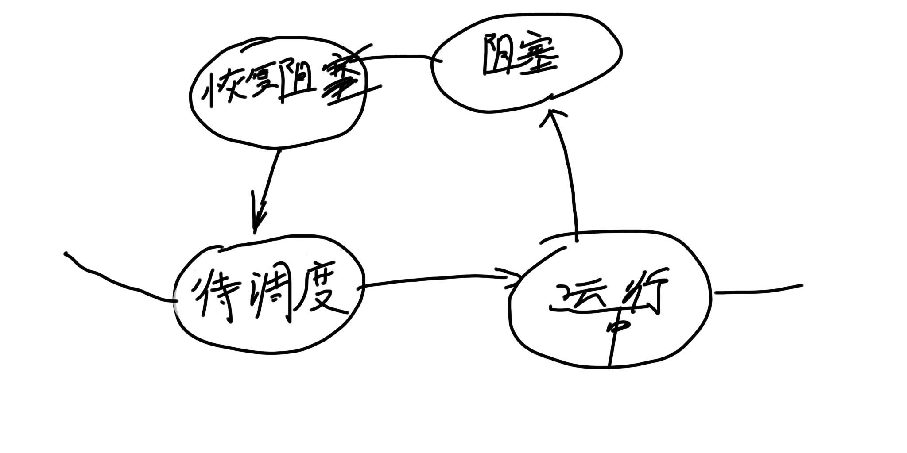

## 线程

- 前置知识(important)
- 线程的定义
- 如何创建一个线程
- 线程里常用的一些方法
- 线程的控制
  - 优先级控制
  - 线程的休眠、让步、挂起和恢复
  - 线程的串行化
  - 线程生命周期控制
- 线程同步(比较难)
  - 线程的死锁
  - 例子
    - 买票
    - 生产和消费问题


---

#### 初学者要注意的四个问题, 除了第三个, 别的在操作系统书里学会即可

- 什么是进程(尽量理解)
- 为什么需要进程(理解)
- 什么是线程(必须掌握)
- 为什么需要线程(不知道也没关系)

---

### 前置知识

---

#### 什么叫程序

- 所谓“程序”，**是一个严格有序的指令集合(静态的保存在存储介质上的)**。程序规定了完成某一任务时，计算机所需做的各种操作，以及这些操作的执行顺序。

---

#### 单道程序设计环境中程序特点

- 单道程序设计环境是指: 计算机中除了操作系统之外, 只存在一个用户程序, 即用户程序独享整个计算机资源
- 单道程序有如下特点: 
  - 资源的独占性：任何时候，位于内存中的程序可以使用系统中的一切资源，不可能有其他程序与之竞争
  - 执行的顺序性：内存中每次只有一个程序，各个程序是按次序执行的，即做完一个，再做下一个
    - 绝对不可能出现在一个程序运行过程中，又夹杂进另一个程序执行的现象存在
  - 结果的再现性：只要执行环境和初始条件相同，重复执行个程序，获得的结果总是一样的。


#### 多道程序设计环境中程序特点

- 多道程序设计是指：计算机中除了操作系统之外，存在多个用户程序，这些程庁同时运行
- 多道程序设计有如下特点
  - 间断性：由于资源共享和合作，并发程序间相互制约，造成合作执行间断。
  - 失去封闭性：程序执行受外界影响
  - 不可再现性：重复执行时，可能得到不同结果。

---

#### 进程的由来

- 一方面为了保持程序“是一个在时间上严格有序的指令集合，是静态的保存在存储介质上"这个概念的原有含义，另一方面为了刻画多个程序共同运行时呈现出的这些特征，在操作系统中，以“程序”为基础，又引入了“进程”这一新的概念！
- 通俗点说，<strong style="color:red;">为了不破坏"程序"这个词原有的含义, 而又能刻画多个程序共同运行时呈现出的新特性, 所以引入了进程这一概念</strong>, 按照大多数教材的说法: "为了使程序能并发执行, 且为了对并发执行的程序加以描述, 所以人们引入了进程"

---

#### 什么叫进程

没有统一说法

- 程序只是一组指令的有序集合，**它本身没有任何运行的含义, 它只是一个静态的实体**
- <strong style="color:red;">进程是程序在某个数据集上的执行</strong>
  <strong style="color:red;">进程是一个动态的实体</strong>，它有自己的生命周期。它因创建而产生，因调度而运行，因等待资源或事件而被处于等待状态,因完成任务而被撤消。


---

### 线程

---

#### 线程的定义

- <strong style="color:red;">线程是一个程序里的不同执行路径</strong>
  以前所编写的程序，每个程序都有一个入口(多为main函数)、一个出口以及一个顺序执行的序列，在程序执行过程中的任何指定时刻，都只有一个单独的执行点
- 事实上，在单个程序内部是可以在同一时刻进行多种运算的这就是所谓的多线程
- 程序、进程、线程的异同参见操作系统，这些并不影响我们对Java的学习

---

#### 多线程的优势

- 多线程编程简单，效率高（能直接共享数据和资源，多进程不）
- 适合于开发服务程序(如Web服务，聊天服务等)

---

#### 如何创建一个线程

- 创建线程的第一种方法
  - 创建一个继承 Thread的类(假定类名为A),并重写 Thread!中的run方法
  - 构造一个A类对象，假定对象名为aa
  - 调用a的 start方法 [ start方法是从 Thread继承过来的 ]


##### 注意问题

- Thread中 `start()` 方法的功能就是创建一个新的线程，<strong style="color:red;">并自动调用该线程的` run()` 方法</strong>，直接调用 `run() `方法是不会创建一个新的线程的
- 执行一个线程实际就是执行该线程`run方法`中的代码
- 执行完`a. start()` 后并不表示 `aa`所对象的线程就一定会立即得到执行，`a. start());`执行完后只是表示 **aa 线程**具有了可以
  立即被CPU执行的资格，但由于想抢占CPU执行的线程很多, CPU并不一定会立即去执行aa所对应的线程
- 一个 Thread对象能且只能代表一个线程，
  <strong style="color:red;">一个 Thread对象不能调用两次 start（）方法</strong>，否则会抛出`java.lang. illegalThreadStateException`异常


- 创建一个新线程的第二种方法

  - 定义一个实现了 Runnable:接口的类，假定为A

  - 创建A类对象aa,代码如下
    - ```java
      A aa new A();
      ```

  - 利用aa构造一个 Thread对象tt

    - ```java
      Thread tt = new Thread(aa);
      ```

  - 调用t中的 start方法

    - ```java
      tt. start();
      ```


- 第二种方法可以理解为 该类实现了Runnable接口, 但是该接口里面没有 start()方法, 所以需要用 线程类(Thread)来new一个对象出来作为工具来传递aa这个对象作为参数传递到 `Thread类对象start()方法内` 进行创建线程

- 实际上 Thread类中的构造函数是这样的:

  ```java
  public Thread(Runnable target) 
  {
        init(null, target, "Thread-" + nextThreadNum(), 0);
  }
  ```

  所以, A是肯定要**实现这个接口的**

---

#### 线程里常用的一些方法

- ```java
  public final void setName(String name)
  ```

  - 设置当前线程的名字

- ```java
  public static Thread currentThread()
  ```

  - 返回对当前正在执行的线程对象的**引用**。

- ```java
  public final String getName()
  ```

  - 返回当前线程的名字


常常这样写:

```java
System.out.printf("%s正在运行\n", Thread.currentThread().getName());//Thread.currentThread().getName()
```


---

#### 线程的控制

```java
isAlive();// 判断线程是否还"活着", 即线程是否还未终止
getPriority();// 获得线程的优先级数值
setPriority();// 设置线程的优先级数值
Thread.sleep();// 将当前线程睡眠指定毫秒数, 这个算"阻塞", 需要先取消阻塞
join();// 调用某线程的该方法, 将当前线程与该线程"合并", 即等待该线程结束, 再恢复当前线程的运行
yield();// 让出CPU, 当前线程进入就绪队列等待调度, 这个是重新成为调度
wait();// 当前线程进入对象的wait pool
notify()/notifyAll();// 唤醒对象的wait pool中的一个/所有等待线程
```


---

##### 优先级控制

- 线程的优先级用数字来表示，范围从`1`到`10`
- 主线程的缺省优先级是5, 子线程的优先级默认与其父线程相同
- Java提供一个线程调度器来监控程序中启动后进入就绪状态的所有线程。线程调度器按照线程的优先级决定应调度哪个线程来执行
- 线程的优先级用数字表示，范围从`1`到`10`,一个线程的缺省优先级是`5`
  - Thread. MIN_PRIORITY =1
  - Thread. MAX_PRIORITY =10
  - Thread. NORM_PRIORITY= 5
- 用下述线方法获得或设置线程对象的优先级
  - int getPriority();
  - void setPriority(int newPriority();

- 通常高优先级的线程将先于优先级低的线程执行，但并不总是这样，因此<strong style="color:red;">实际开发中并不单纯依赖优先级来决定线程运行次序</strong>


- [**时间片轮转算法**](http://c.biancheng.net/view/1247.html)
  - 时间片时间都是`10 - 100ms`
  - 如果一个时间片 完成了cpu 就会换下一个进程

---

##### 线程的休眠、让步、挂起和恢复

##### 线程的休眠

- 线程休眠一一暂停执行当前运行中的线程，使之进入**阻塞状态**，待经过指定的“**延迟时间**”后再醒来并转入到就绪状态。

  

- **Thread**类提供的相关方法:
  
  - ```java
    public static void sleep(long millis)
    ```
  
  - ```java
    public static void sleep( long millis, int nanos)
    ```
- 由于是**静态方法**，可以由 **Thread**直接调用
- `sleep() 方法`会抛出 `InterruptedException`异常，我们必须得对其进行捕捉, **注意, 因为 Runnable 没有throws, 所以我们不能用 throws 把异常往外抛出, 只能写 try catch**

-  Thread.sleep() 示例

```java
package a;

public class A implements Runnable
{
    public void run()
    {
        for(int i = 0 ; i < 10; i ++)
        {
            System.out.println(Thread.currentThread().getName() + "   " + i);
            try// try catch是必须写的, 也就是必须去捕获
            {
                Thread.sleep(1000);// 会让其进入阻塞状态
            }
            catch (Exception e)
            {

            }
        }
    }
}
------------------------------------------------------------------------------
package a;

public class TestSleep
{
    public static void main(String[] args)
    {
        A aa = new A();
        Thread tt = new Thread(aa);
        tt.start();

        for(int i = 0; i < 10; i ++)
        {
            System.out.printf("main线程的执行次数: %d\n", i);
            try
            {
                Thread.sleep(1000);
            }
            catch (Exception e)
            {
            }
        }
    }
}
------------------------------------------------------------------------------
结果:(每隔1000ms, 就会连续打印两行的内容)
main线程的执行次数: 0
Thread-0   0
main线程的执行次数: 1
Thread-0   1
main线程的执行次数: 2
Thread-0   2
main线程的执行次数: 3
Thread-0   3
main线程的执行次数: 4
Thread-0   4
main线程的执行次数: 5
Thread-0   5
main线程的执行次数: 6
Thread-0   6
main线程的执行次数: 7
Thread-0   7
main线程的执行次数: 8
Thread-0   8
main线程的执行次数: 9
Thread-0   9

进程已结束，退出代码为 0

```


无论是继承 Thread 类的run方法还是实现 Runnable 接口的方法, 都不能抛出任何异常

原因是: **重写的方法抛出异常的范围不能大于被重写方法排除的异常错误**

---

##### **线程的让步**

- 让出cpu, 给其他线程执行的机会

- 让运行中的线程主动放弃当前获得的CPU处理机会, 但不是使该线程阻塞, 而是使之转入就绪状态

  - ```c++
    public static void yield();
    ```

---

##### 线程的挂起和恢复

- 线程挂起一暂时停止当前运行中的线程，使之转入阻塞状态，**并且不会自动恢复运行**。

- 线程恢复一一使得一个已挂起的线程恢复运行。

- Thread类提供的相关方法

  - ```java
    public final void suspend()//(已经不用了, 容易死锁)
    ```

  - ```java
    public final void resume()//(已经不用了, 容易死锁)
    ```

    

- suspend() 方法挂起线程时并不释放其锁定的资源。这可能会影响其他线程的运行，且容易导致线程的**死锁**，<strong style="color:red;">已不提倡使用</strong>


---

##### 线程的串行化

- 在多线程程序中, 如果在一个线程运行的过程中要用到另一个线程的运行结果, 则可进行线程的串型化处理

- ```java
  public final void join() throws InterruptedException
  ```

- t.join; 会暂停当前正在执行的线程, 开始执行t所对应的线程, 运行终止后, 刚才被暂停的线程才会有继续执行的机会


---

#### 线程同步(难)


