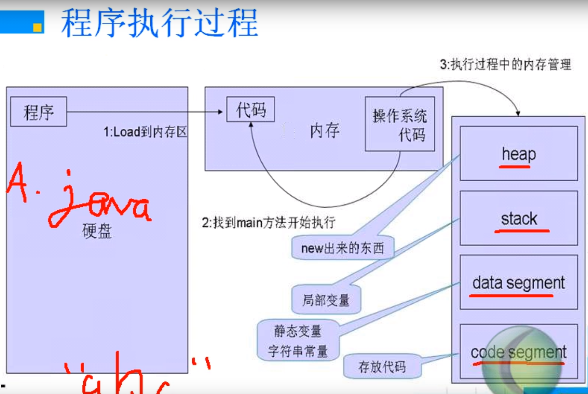

## 大纲

- 什么叫面对对象
  - 面对对象与面向过程的区别
- 什么叫类
  - 类与对象
- 内存分配问题
- 访问控制符
- 构造函数
- 关键字this
- 关键字static

---

#### 什么叫面对对象

**面向过程**: 自顶向下的设计模式 main-> 各个函数 ->各个函数....

设计思想:

- 分析出解决问题的步骤,然后用函数把这些步骤一步一步实现
- 以算法为核心
- 自顶向下设计, 要求一开始必须对问题有很深的了解
- 将大问题转化为若干小问题来解决
- 表现形式: 用函数来作为划分程序的基本单位
- 直接面向问题


##### 优点:

- 易于掌握与理解, 符合人们的思维习惯

- 对于需求明确, 规模不大, 变动较小的问题非常适合


##### 缺点:

- 数据和操作是分离的, 对数据与操作的修改变得很困难(但是很适合数据结构和算法的思想应用)

- 数据的安全性得不到保证

- 程序架构的依赖关系不合理
  - main函数依赖于函数, 子函数又依赖于更小的子函数; 而子函数往往是细节的实现, 这些实现是经常变化的, 造成的结构就是: 程序的核心逻辑依赖于外延的细节, 一个细节上的小改动, 会引起一系列的变动
- 对于 "需求不明确, 变动较大, 规模很大的问题", 显得吃力


##### 面对对象的设计思想

- 确定该问题由哪些事物组成 先用类模拟出该事物
- 通过类间接地解决问题
- 自下而上设计, 从问题的一部分着手, 一点一点地构建出整个程序
- 表现形式: 用类来作为划分程序的基本单位
- 对于需求不明确, 变动较大, 规模很大的问题非常适合 
- 对于"需求明确 , 规模不大, 变动较小的问题"则显得十分累赘

---

#### 什么叫做类

- **把一类事物的静态属性和动态可以执行的操作组合在一起所得的概念就叫类**
- 类是抽象的, 用来模拟一类事物, 是一个概念
- 一旦被定义, 类的概念就永远存在了

---

#### 什么叫做对象

- 类的一个个体
- 具体的, 实实在在存在的事物
- 生命周期是短暂的, 会生成和消亡

---

#### 内存分配问题

例子程序:

```java
package qaq;

public class A
{
    int i;
    int j;
}
------
package qaq;

public class TestMemo
{
    public static void main(String[] args)
    {
        A aa = new A();

    }
}
```

- `new A()` 表示在堆中动态分配一块区域, 被当做了A对象(等价于c中的 `(A*)malloc(sizeof(A));`
- `aa` 本身的内存是在栈中分配的
- 堆中内存的地址赋给了 `aa`
- `aa` 指向堆中的内存, `aa` 代表了堆中的内存
- `aa.i` 等价于 `(*aa).i`, `aa.j`等价于 `(*aa).j`, aa这个静态指针变量所指向的动态内存中的A对象的i, j这两个成员

##### 程序执行过程



---

#### 访问修饰符


- 类的访问修饰符有四种
  - public
  - protect
  - friendly(默认)
  - private


- 在一个类的内部, 所有的成员可以互相访问, 访问修饰符是透明的; 访问控制符是针对外部访问而言的
- 外部访问包括两种方式
  - 通过**类名**访问类内部的成员
  - 通过**类对象名**访问类内部成员


---

#### 构造函数

在new一个对象的时候, 往往这个对象具有一定的初始化操作, 这时候就可以有构造函数了

构造函数会在new对象的时候直接被调用执行

构造函数名与类名相同, 然后不需要写void, 因为构造函数根本不可能有返回值, 根本没有东西去接受, 只会执行, 所以压根不存在这个东西


**需要注意的是, 如果不写构造函数, 会默认有一个什么都不干的无参构造函数, 但是如果你写了一个构造函数,  那么如果这个构造函数是有参的, 你new对象的时候调用的是无参的那就会报错, 因为不存在没有参数的重载构造函数**

**也就是说你自己写了就不会生成默认的了**

 

- 构造函数的返回值问题
  - 在一个类中可以定义多个函数名与类名相同但却有返回值的函数, 返回值为void int double 都行, 这些有返回值的函数只要满足重载的特点, 就可以同时存在一个类中, 不过要注意: 这些有返回值的函数(包括返回值为void的函数)都不是构造函数, 都不会被类对象自动调用
  - 当然也可以定义多个没有任何返回值的函数, 注意连void都不可以加, 这些函数才是构造函数, 无返回值的函数才会被对象自动调用
  - 如果定义了有返回值并且方法名与类名相同的方法, 程序并不会报错, 但容易产生歧义, 所以**强烈建议不要在构造方法前面加返回值**


- 构造函数数据成员的赋值问题1
  - 数值型的都是0
  - char是 \u0000 表示空
  - boolean 是 false
  - All reference type 是 Null


- 构造函数数据成员的赋值问题1
  - java允许在定义的时候同时赋值, 但是C++不行, C++的一个类的数据成员只能构造函数来初始化
  - **系统会先执行定义时赋的值, 然后再执行构造函数, 所以如果初始化了, 但是构造函数又改了, 是以构造函数中为准**


- 多个构造函数可能带来的冲突
  - **一旦编程者为类定义了构造方法, 系统就不再提供默认的构造方法了**
