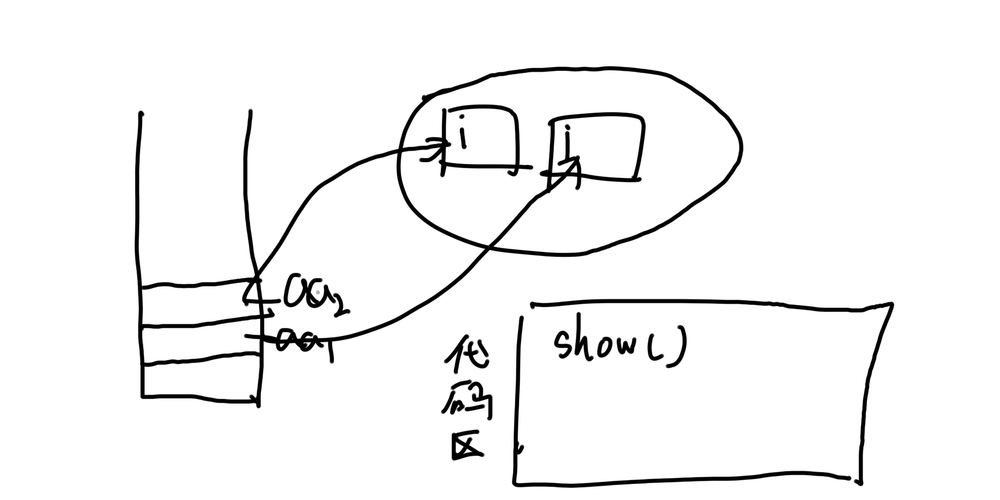

## 大纲

- 什么叫面对对象
  - 面对对象与面向过程的区别
- 什么叫类
  - 类与对象
- 内存分配问题
- 访问控制符
- 构造函数
- 函数的重载
- 关键字this
- 关键字static

---

#### 什么叫面对对象

**面向过程**: 自顶向下的设计模式 main-> 各个函数 ->各个函数....

设计思想:

- 分析出解决问题的步骤,然后用函数把这些步骤一步一步实现
- 以算法为核心
- 自顶向下设计, 要求一开始必须对问题有很深的了解
- 将大问题转化为若干小问题来解决
- 表现形式: 用函数来作为划分程序的基本单位
- 直接面向问题


##### 优点:

- 易于掌握与理解, 符合人们的思维习惯

- 对于需求明确, 规模不大, 变动较小的问题非常适合


##### 缺点:

- 数据和操作是分离的, 对数据与操作的修改变得很困难(但是很适合数据结构和算法的思想应用)

- 数据的安全性得不到保证

- 程序架构的依赖关系不合理
  - main函数依赖于函数, 子函数又依赖于更小的子函数; 而子函数往往是细节的实现, 这些实现是经常变化的, 造成的结构就是: 程序的核心逻辑依赖于外延的细节, 一个细节上的小改动, 会引起一系列的变动
- 对于 "需求不明确, 变动较大, 规模很大的问题", 显得吃力


##### 面对对象的设计思想

- 确定该问题由哪些事物组成 先用类模拟出该事物
- 通过类间接地解决问题
- 自下而上设计, 从问题的一部分着手, 一点一点地构建出整个程序
- 表现形式: 用类来作为划分程序的基本单位
- 对于需求不明确, 变动较大, 规模很大的问题非常适合 
- 对于"需求明确 , 规模不大, 变动较小的问题"则显得十分累赘

---

#### 什么叫做类

- **把一类事物的静态属性和动态可以执行的操作组合在一起所得的概念就叫类**
- 类是抽象的, 用来模拟一类事物, 是一个概念
- 一旦被定义, 类的概念就永远存在了


- 类与属性
  - 属性的字段不赋值,会初始化
  - 而函数里的局部变量不初始化会有问题(java是强类型的)


- 一个类的属性可以是个类对象

  ```java
  package aaa;
  
  public class A
  {
      public void f()
      {
          System.out.printf("you are a superman");
      }
  }
  --------------------------------
  package aaa;
  
  public class C// 这样如果new一个C类的对象的时候, 就会顺便new一个A类的对象
  {
      public int i = 20;
      public A aa = new A();// aa一定是个对象, aa也是个属性
  
      public void g()
      {
          aa.f();
      }
  }
  ------------------------------------
  package aaa;
  
  public class TestThis_1
  {
      public static void main(String[] args)
      {
          C c1 = new C();
          c1.g();
      }
  }
  ```

  

---

#### 什么叫做对象

- 类的一个个体
- 具体的, 实实在在存在的事物
- 生命周期是短暂的, 会生成和消亡

---

#### 内存分配问题

例子程序:

```java
package qaq;

public class A
{
    int i;
    int j;
}
------
package qaq;

public class TestMemo
{
    public static void main(String[] args)
    {
        A aa = new A();

    }
}
```

- `new A()` 表示在堆中动态分配一块区域, 被当做了A对象(等价于c中的 `(A*)malloc(sizeof(A));`
- `aa` 本身的内存是在栈中分配的
- 堆中内存的地址赋给了 `aa`
- `aa` 指向堆中的内存, `aa` 代表了堆中的内存
- `aa.i` 等价于 `(*aa).i`, `aa.j`等价于 `(*aa).j`, aa这个静态指针变量所指向的动态内存中的A对象的i, j这两个成员, 这里是java语法的简化,切记不要与c混淆, c中这里是肯定不等价的

##### 程序执行过程


---

#### 访问修饰符


- 类的访问修饰符有四种
  - public
  - protect
  - friendly(默认)
  - private


- 在一个类的内部, 所有的成员可以互相访问, 访问修饰符是透明的; 访问控制符是针对外部访问而言的
- 外部访问包括两种方式
  - 通过**类名**访问类内部的成员
  - 通过**类对象名**访问类内部成员


---

#### 构造函数

在new一个对象的时候, 往往这个对象具有一定的初始化操作, 这时候就可以有构造函数了

构造函数会在new对象的时候直接被调用执行

构造函数名与类名相同, 然后不需要写void, 因为构造函数根本不可能有返回值, 根本没有东西去接受, 只会执行, 所以压根不存在这个东西


**需要注意的是, 如果不写构造函数, 会默认有一个什么都不干的无参构造函数, 但是如果你写了一个构造函数,  那么如果这个构造函数是有参的, 你new对象的时候调用的是无参的那就会报错, 因为不存在没有参数的重载构造函数**

**也就是说你自己写了就不会生成默认的了**

 

- 构造函数的返回值问题
  - 在一个类中可以定义多个函数名与类名相同但却有返回值的函数, 返回值为void int double 都行, 这些有返回值的函数只要满足重载的特点, 就可以同时存在一个类中, 不过要注意: 这些有返回值的函数(包括返回值为void的函数)都不是构造函数, 都不会被类对象自动调用
  - 当然也可以定义多个没有任何返回值的函数, 注意连void都不可以加, 这些函数才是构造函数, 无返回值的函数才会被对象自动调用
  - 如果定义了有返回值并且方法名与类名相同的方法, 程序并不会报错, 但容易产生歧义, 所以**强烈建议不要在构造方法前面加返回值**


- 构造函数数据成员的赋值问题1
  - **当一个对象被创建的时候, 会对其中各种类型的成员变量自动进行初始化赋值**
  - **而局部变量编译器是不会自动进行初始化的, 而java要求所有的局部变量在使用前都需要初始化**
  - 数值型的都是0
  - char是 \u0000 表示空
  - boolean 是 false
  - All reference type 是 Null


- 构造函数数据成员的赋值问题1
  - java允许在定义的时候同时赋值, 但是C++不行, C++的一个类的数据成员只能构造函数来初始化
  - **系统会先执行定义时赋的值, 然后再执行构造函数, 所以如果初始化了, 但是构造函数又改了, 是以构造函数中为准**


- 多个构造函数可能带来的冲突
  - **一旦编程者为类定义了构造方法, 系统就不再提供默认的构造方法了**

---

#### 函数的重载

**同名的函数通过不同的形参做类似的事, 这就叫做函数的重载**

C语言中是无函数重载的, 要写很多名字

- 而C++和java是可以写很多名字一样但是参数的数据类型, 参数的个数不同的重载函数, 方便调用


- 函数重载的要求
  - 形参个数
  - 形参顺序
  - 形参的数据类型
- 如果两个函数只是函数的返回值不一样, 其他都一样, 这不是函数重载, 编译时会报错
  - 原因很简单, 因为调用函数的时候是靠不同重载函数的标识符选择的, 而返回值无标识符, 而且调用两个函数, 只是写了函数的名字和参数, 只有返回值一样, 编译器无从得知调用的是哪个

---

#### 关键字this

- 是一个系统隐含的指针被自动附加在非静态的成员函数参数列表中.
- 当前时刻, 哪个对象调用该函数, 那么this就指向当前调用该函数的对象, 系统会自动在该函数的参数列表中添加一个隐藏的this指针, 并且把调用该函数的对象的地址赋给this指针, 这样一来, 在函数的内部通过this就可访问当前正在调用该函数的对象的成员
- 静态函数内部, 没有this指针


**例子程序:**

```java
package aaa;

public class A
{
    public int i;
    public A(int j)
    {
        i = j;
    }

    public void show()
    {
        System.out.printf("i = %d\n", i);
    }
}
-------------
package aaa;

public class TestThis_1
{
    public static void main(String[] args)
    {
        A aa1 = new A(10);
        A aa2 = new A(20);
        aa1.show();
        aa2.show();
    }
}
```



- 其中, 只会在堆中分配i, 而不会分配show()等函数, show()等函数分配到代码区(不然浪费空间)


- 代码其实隐含着这样的内容:

  ```java
  public void show(A* this)// C的写法, 和java就不一样了, java是能直接 this.i来调用的
  {
  	System.out.printf("i = %d\n", (*this).i);
  }
  
  public class TestThis_1
  {
      public static void main(String[] args)
      {
          A aa1 = new A(10);
          A aa2 = new A(20);
          aa1.show();// aa1.show(aa1);
          aa2.show();// aa2.show(aa2);
      }
  }
  ```

  - 可以看到, 实际上调用show()的时候会把调用该函数的对象的地址传到show函数里, 成为this, 然后show会通过调用this来调用heap里对应的空间, 然后调用对应空间内的成员变量, 比如i
  - **其中的非构造方法里的this代表的是当前正在调用show方法的对象**


- **this的一种应用**

- **this在构造方法里代表当前时刻正在创建的对象**

  ```java
  package aaa;
  
  public class A
  {
      private int i;
      public A(int i)
      {
          this.i = i;// 将形参 i 赋给该构造方法本次运行所创建的那个新对象的 i 数据成员
          //this在构造方法里代表当前时刻正在创建的对象
      }
  
      public void show()
      {
          System.out.printf("i = %d\n", i);
      }
  }
  ----------------------------------------------
  
  package aaa;
  
  public class TestThis_1
  {
      public static void main(String[] args)
      {
          A aa1 = new A(100);
          A aa2 = new A(200);
          aa1.show();
          aa2.show();
      }
  }
  ```

----

#### 关键字static

static是让该变量的空间分配到 ` data segment` 而不是 `stack` 或者 `heap`了

例子:

- A类的多个对象共用了一个 static 属性

```java
package aaa;

public class A
{
    public static int i = 0;// 

    public void show()
    {
        System.out.printf("i = %d\n", i);
    }
}
---------------
package aaa;

public class TestThis_1
{
    public static void main(String[] args)
    {
        A aa1 = new A();
        A aa2 = new A();
        A aa3 = new A();
        aa1.i += 10 ;
        aa1.show();
        aa2.i += 10;
        aa2.show();
        aa3.i += 10;
        aa3.show();
    }
}
```


- static声明的东西(成员变量, 成员函数)是属于类本身的而不是对象的, 该变量是用类名来调用的

  static属性和方法虽然属于类本身, 虽然可以通过类名的方式访问, 但是static属性和方法很明显也属于类对象, 当然也可以通过类对象来访问

```java
package aaa;

public class A
{
    public static int i = 10;

    public void show()
    {
        System.out.printf("i = %d\n", i);
    }
}
------------------------
package aaa;

public class TestThis_1
{
    public static void main(String[] args)
    {
        System.out.printf("%d\n", A.i);
    }
}
```


- static只是表示了该属性或方法可以被类名直接调用, 但是具体能不能调用还得看**访问修饰符**

  ```java
  package aaa;
  
  public class A
  {
      public static int i = 10;
  
      private static void show()// 这时候, 就不能访问了
      {
          System.out.printf("i = %d\n", i);
      }
  }
  ------------------------
  package aaa;
  
  public class TestThis_1
  {
      public static void main(String[] args)
      {
          A.show();
      }
  }
  ```

  **上面的性质可以知道以下的性质**

- 非静态的函数可以访问静态的函数, 因为如果从非静态去调用静态, 说明是对象去调用的, 对象是拥有调用静态动东西的权利的

- 相对应的, 静态的函数不可以访问非静态的函数, 因为如果是从静态的进入的, 那**可能**无对象, 而非静态函数是需要对象才能访问的, 所以没有访问权

  ```java
  package aaa;
  
  public class A
  {
      public static int i = 10;
  
      public static void f()
      {
          System.out.printf("FFFF\n");
      }
  
      public static void g()
      {
          f();
          System.out.printf("GGGG\n");
      }
  }
  -----------------------------------------------
  package aaa;
  
  public class TestThis_1
  {
      public static void main(String[] args)
      {
          A aa = new A();
          aa.g();
      }
  }
  ```


- **static 的两个实际使用例子**

  - **一个class(一个模型)当前造出了几个事物**

    ```java
    package aaa;
    
    public class A
    {
        private int i;
        private static int cnt = 0;
    
        public A()
        {
            cnt ++;
        }
    
        public A(int i)
        {
            this.i = i;
            cnt ++;
        }
    
        public static int getCnt()
        {
            return cnt;
        }
    }
    --------------------------------------------
    package aaa;
    
    public class TestThis_1
    {
        public static void main(String[] args)
        {
            System.out.printf("当前时刻A对象的个数是: %d\n", A.getCnt());
            A aa1 = new A();
            System.out.printf("当前时刻A对象的个数是: %d\n", A.getCnt());
            A aa2 = new A();
            System.out.printf("当前时刻A对象的个数是: %d\n", A.getCnt());
        }
    }
    ```

  - **保证一个类只造一个对象, 方法是把构造函数给私有化, 不使用new来创建对象, 然后重新写个新建的方法来创造对象**

    ```java
    package aaa;
    
    public class A
    {
        public int i = 20;
        private static A aa = new A();
    
        private A()
        {
        }
    
        public static A getA()// 注意这里一定要是静态的, 不然调用不了
        {
            return aa;
        }
    }
    
    -----------------------------------------
    package aaa;
    
    public class M
    {
        public static void main(String[] args)
        {
            A aa1 = A.getA();
            A aa2 = A.getA();
    
            System.out.println(aa1.i);
            aa1.i = 99;
            System.out.println(aa2.i);
        }
    }
    ----------------------------------------------
    最后结果为
    20
    99
    说明只造了一个对象
    ```


##### static属性总结

- 静态成员属于类本身, 而不是属于对象, 被类的所有对象所共有
- 即便不创建对象, 也可以使用类本身的静态成员
- 静态成员被分为
  - 静态数据成员
  - 静态方法成员
- 使用静态成员的两种方法
  - 类名.静态成员名
  - 类对象名.静态成员名
- 编写使用静态变量统计一个类产生的实例对象的个数的程序


**static方法总结**

- **在静态方法里只能直接调用同类中其他的静态成员(包括变量和方法), 而不能直接访问类中的非静态成员.**这是因为, 对于非静态的方法和变量, 需要先创建类的实例对象后才使用, 而静态方法在使用前不用创建任何对象
- 静态方法不能以任何方式引用this和super关键字. 与上面道理一样, 因为静态方法在使用前不用创建任何实例对象, 当静态方法被调用的时候,this所引用的对象根本就没有产生.
- 静态方法只能访问类的静态成员, 但非静态方法却可以访问类中所有成员, 包括静态成员

----


