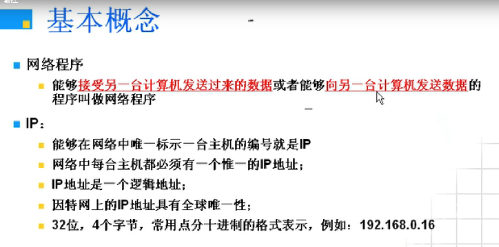
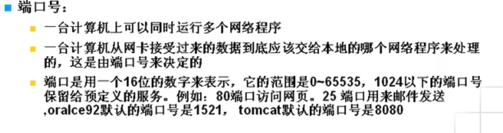
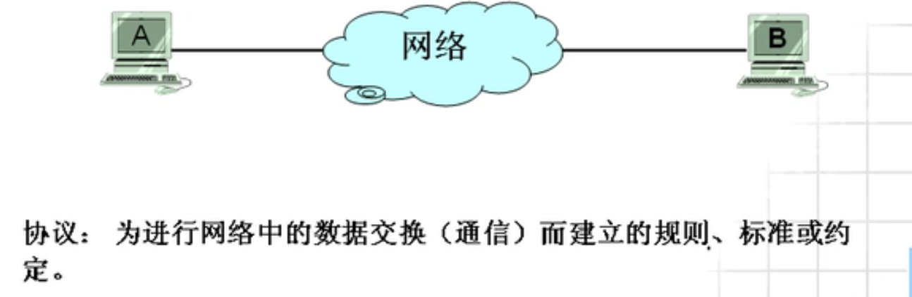
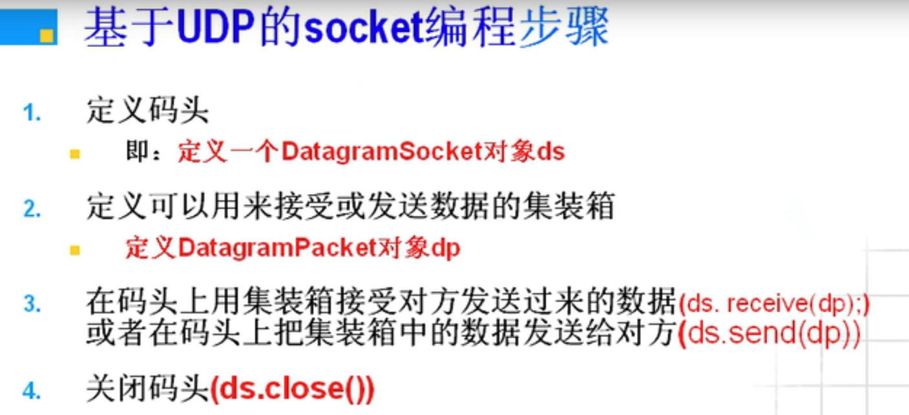
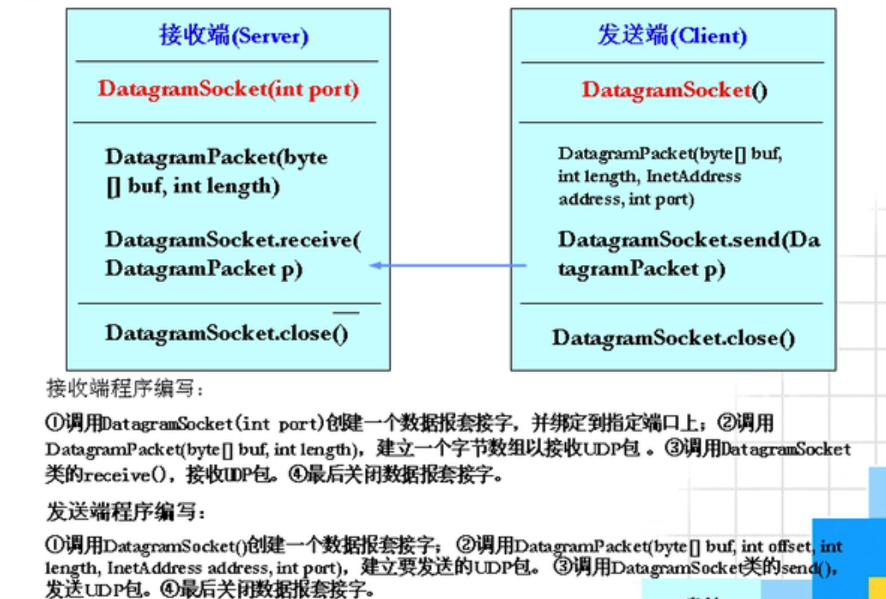
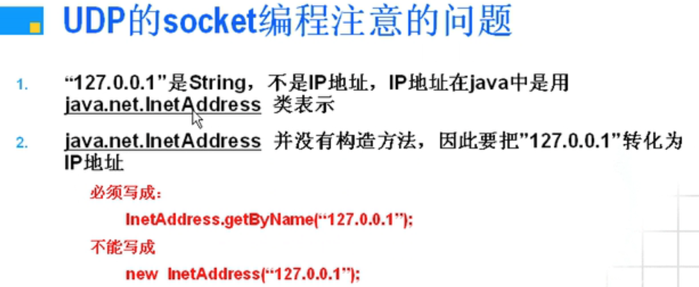
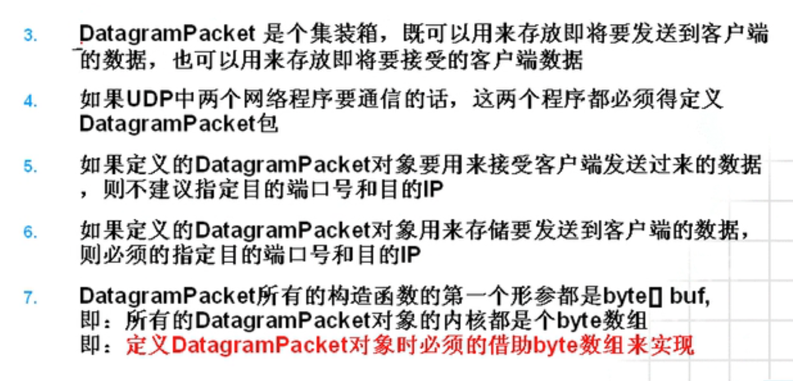
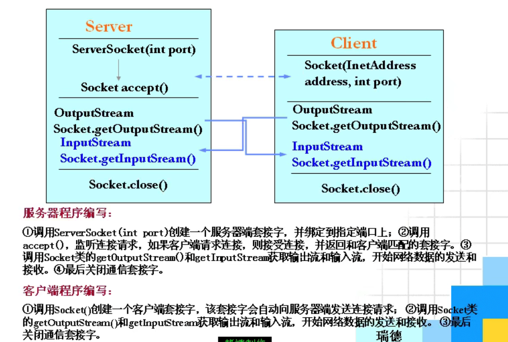
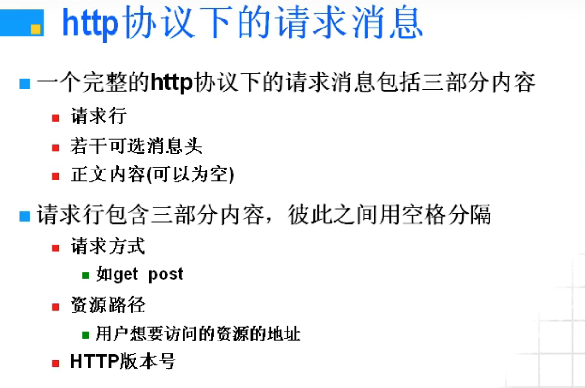
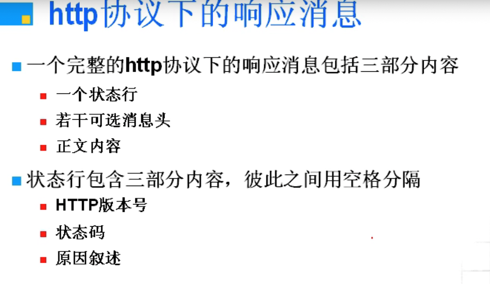

## 网络编程








##### 所以发送一个程序需要:

- IP地址 (发到哪台机器)
- 协议 (怎么发送)
- 端口 (发给这台机器的哪个网络程序上)

---

#### 常见协议(暂时理解这么多)

- TCP: 面向连接的可靠的传输协议. 类似于打电话
- UDP: 是无连接的, 不可靠的传输协议. 类似于写信

---

#### 基于UDP的socket编程


##### 步骤(比喻)



1. 用`DatagramSocket(端口号)`来定义一个对象ds(生成环境)
2. 用`DatagramPacket`来定义一个对象dp(定义发送包)
3. 用`ds.receive(dp) ` `ds.send(dp)` (在ds环境上接收以及发送dp包)
4. `ds.close()` (关闭环境)





##### UDP的socket编程注意的问题





##### 实例

- 接收端

```java
package a;

import java.io.ByteArrayInputStream;
import java.io.DataInput;
import java.io.DataInputStream;
import java.net.DatagramPacket;
import java.net.DatagramSocket;

public class NetworkTest_1
{
    public static void main(String[] args) throws Exception
    {
        //定义码头
        DatagramSocket ds = new DatagramSocket(5678);

        //定义可以用接收数据的集装箱
        byte buf[] = new byte[2048];
        DatagramPacket dp = new DatagramPacket(buf, buf.length);

        try
        {
            while(true)//一直监听
            {
                //在码头上用集装箱接收对方发送过来的数据
                ds.receive(dp);
                //从集装箱中取出对方发送过来的数据
                ByteArrayInputStream bais = new ByteArrayInputStream(dp.getData());
                DataInputStream dis = new DataInputStream(bais);

                System.out.println(dis.readLong());
            }
        }
        catch (Exception e)
        {
            e.printStackTrace();
            ds.close();// 关闭码头
        }
    }
}
```

- 发送端

```java
package a;

import java.io.ByteArrayInputStream;
import java.io.ByteArrayOutputStream;
import java.io.DataInputStream;
import java.io.DataOutputStream;
import java.net.DatagramPacket;
import java.net.DatagramSocket;
import java.net.InetSocketAddress;

public class NetworkTest_2
{
    public static void main(String[] args) throws Exception
    {

        //定义码头ds
        DatagramSocket ds = new DatagramSocket();

        //定义可以发送数据的集装箱dp
        //先要转化为字节(需要使用缓存数组buf)

        long n = 1000L;
        ByteArrayOutputStream baos = new ByteArrayOutputStream();
        DataOutputStream dos = new DataOutputStream(baos);
        dos.writeLong(n);

        byte[] buf = baos.toByteArray(); // DataOutputStream 流
        DatagramPacket dp = new DatagramPacket(buf, buf.length, new InetSocketAddress("192.168.1.3", 5678));

        //在码头上把集装箱中的数据发送给对方
        ds.send(dp);
    }
}
```


---

#### 基于TCP的socket编程

- 接收端

```java
package a;

import java.io.DataInputStream;
import java.net.ServerSocket;
import java.net.Socket;

public class TCPServer
{
    public static void main(String[] args) throws Exception
    {
        ServerSocket ss = new ServerSocket(6666);// 注意, 这行代码执行完并没有开始监听6666端口
        while(true)
        {
            Socket s = ss.accept();// accept()是阻塞式方法, 如果接收不到客户端的连接该程序的线程就会进入阻塞状态
            System.out.println("一个连接已经建成");
            DataInputStream dis = new DataInputStream(s.getInputStream());// s就已经是一个原始流了, 就不用new一个InputStream对象了
            System.out.println(dis.readUTF());
            dis.close();
            s.close();
        }
    }
}
```

- 发送端

```java
package a;

import java.io.DataInputStream;
import java.io.DataOutputStream;
import java.io.OutputStream;
import java.net.Socket;

public class TCPlicent
{
    public static void main(String[] args) throws Exception
    {
        Socket s = new Socket("192.168.1.3", 6666);// 该行代码执行完, 构造函数就会自动发起连接

        OutputStream os = s.getOutputStream();// 一旦连接成功, 就说明已经建成了s管道, 此时用os来获取这个管道流, 就不用new一个原始流了
        DataOutputStream dos = new DataOutputStream(os);//  然后套上数据输出流
        dos.writeUTF("Date A Live");
        dos.flush();
        dos.close();
        s.close();
    }
}
```

##### 基于TCP的socket编程图解



---

#### HTTP协议

- http是浏览器和服务器之间进行数据传输的一个协议
- 浏览器发送到服务器的数据称为请求消息
- 服务器发送到浏览器的称为响应消息

##### http协议下的请求消息



##### http协议下的响应消息


